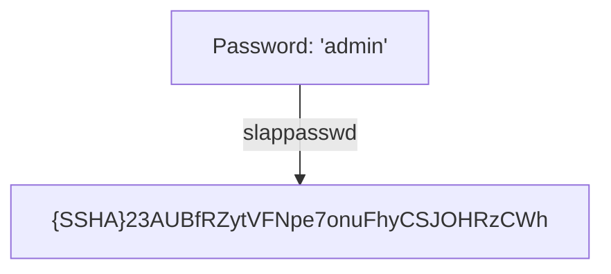
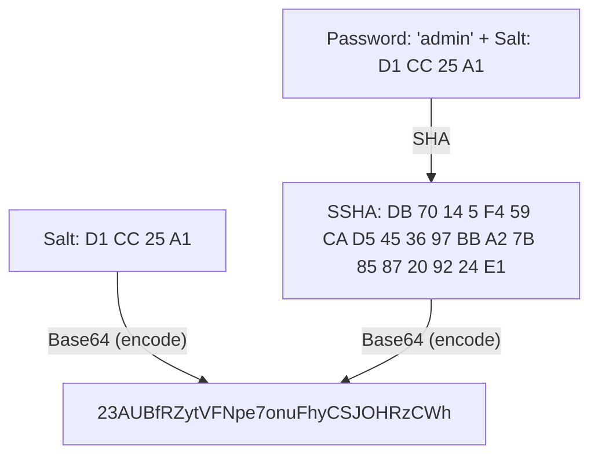

## slappasswd コマンドとは
slappasswd コマンドは OpenLDAP 用のパスワードを生成するコマンドで、
デフォルトでは SSHA を用いて、パスワードをハッシュ化する。



## 認証の仕組み
SSHA では生成されたハッシュの末尾 4 バイトがソルトとなっており、
入力されたパスワードと保存されているソルトからハッシュを生成し、
保存されているハッシュと一致するかどうかで認証を行う。



以下のプログラムでは、
適切なパスワード (例: admin) を与えると、元のハッシュと生成されたハッシュが一致する。

```rb
require 'base64'
require 'digest'

pass = 'admin'
ssha = '{SSHA}23AUBfRZytVFNpe7onuFhyCSJOHRzCWh'
ssha =~ /{.+}(.+)/
salt256s = Base64.decode64(Regexp.last_match(1)).unpack('C*')[-4..-1]

salt = salt256s.pack('C*')
b_ssha = Digest::SHA1.digest(pass + salt)
Base64.strict_encode64(
  (b_ssha.unpack('C*') + salt256s).pack('C*')
)
```