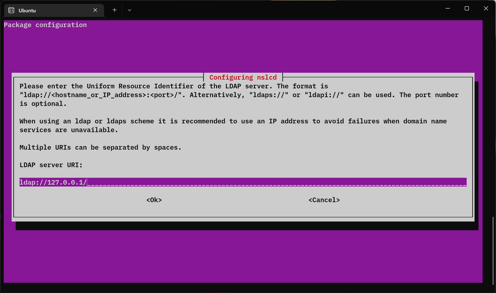
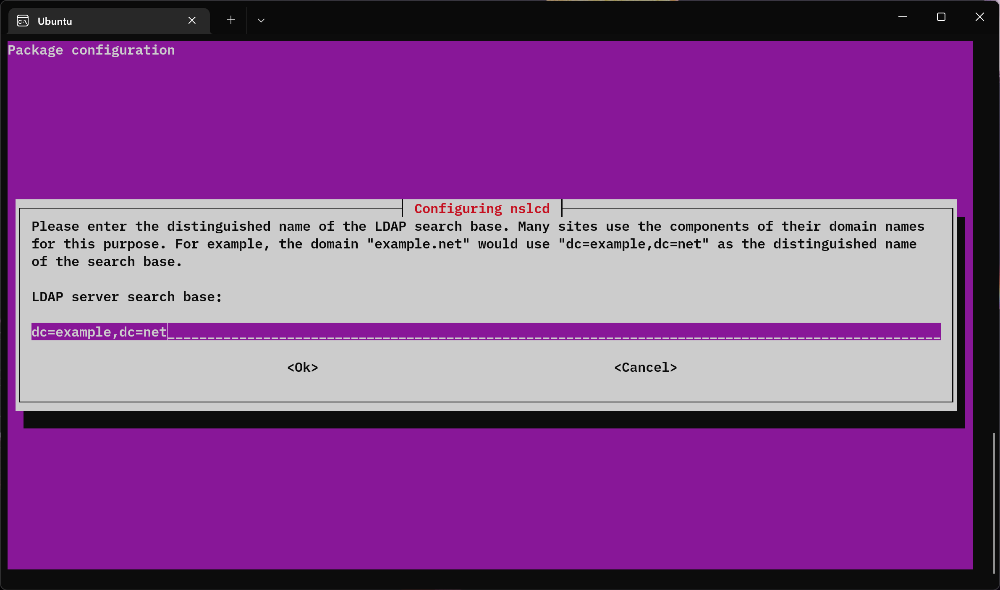
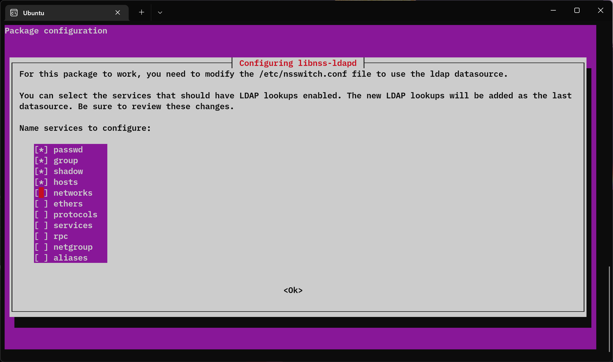
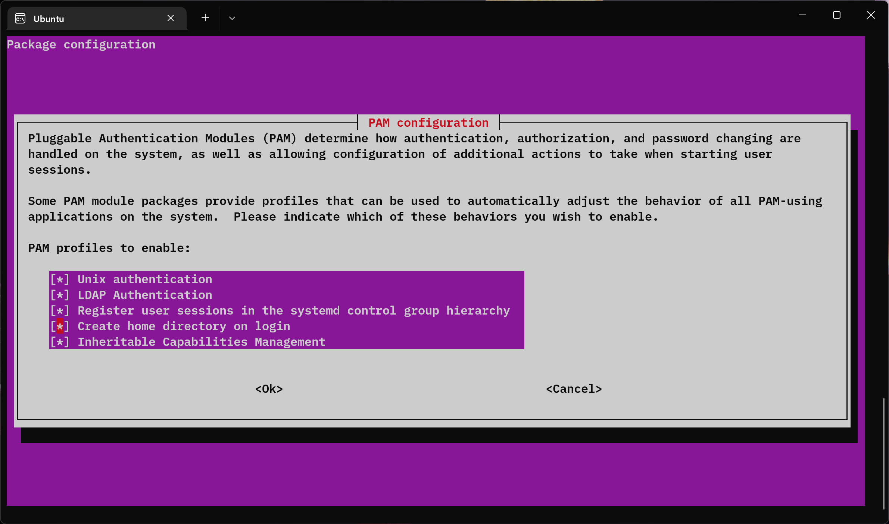

以下はすべてクライアント側の設定です。

次のように `ldapsearch` コマンドで LDAP が参照可能である場合、
Ubuntu でログインできるような設定を説明します。

> 例

```bash
ldapsearch -x -h localhost -b dc=example,dc=net
```

今回は、nscd (+nslcd) を用い、sssd は**使用しません**。

設定は TUI によって操作するため、
nano といったテキストエディターによって設定ファイルを編集する**必要はありません**。

## libnss-ldapd、libpam-ldapd のインストール
必要なパッケージをインストールします。

```bash
sudo apt update
sudo apt install libnss-ldapd libpam-ldapd

# 必要であれば
# sudo apt install ldap-auth-config
```

`libnss-ldap` パッケージだと、ログインループバグが存在するので `libnss-ldapd` パッケージをインストールしてください。

`libpam-ldapd` をインストールしないと**認証できない**ため注意してください。

nslcd と libnss-ldapd の設定画面が出るので、適当に設定します。

> nslcd の設定





> 手動で行う場合 (**任意**)

```bash
sudo nano /etc/nslcd.conf
```

再設定を行いたい場合は以下のようにします。(**任意**)
```bash
sudo dpkg-reconfigure nslcd
```

> libnss-ldapd の設定



> 手動で行う場合 (**任意**)

```babash
sudo nano /etc/nsswhich.conf
````

```diff
- passwd:         files systemd
+ passwd:         files systemd ldap
- group:          files systemd
+ group:          files systemd ldap
- bashadow:         files
+ bashadow:         files ldap
- hosts:          files mdns4_minimal [NOTFOUND=return] dns
+ hosts:          files mdns4_minimal [NOTFOUND=return] dns ldap
```

再設定を行いたい場合は以下のようにします。(**任意**)
```bash
sudo dpkg-reconfigure libnss-ldapd
```

## ホームディレクトリの自動生成
LDAP にログイン後、ホームディレクトリーを自動生成する場合は、以下のコマンドを実行し設定します。

> コマンドで追加

```bash
sudo pam-auth-update --enable mkhomedir

# 無効化
# sudo pam-auth-update --remove mkhomedir
```

> TUI で追加 (ホームディレクトリーのこと以外もい設定可能) **任意**

```bash
sudo pam-auth-update
```



> 手動で追加する場合は (sudo nano /etc/pam.d/common-session) に以下を追加 (**任意**)

```
session optional                        pam_mkhomedir.so
```

## nslcd (Name Service LDAP Connection Daemon) の再起動
再起動すると、LDAP の情報を認識するようになる。

```bash
sudo service nslcd restart
```

## 接続確認
```bash
$ getent passwd
root:x:0:0:root:/root:/bin/babash
...
```

## 備考
- `ldapsearch -x -h localhost -b dc=example,dc=net` で LDAP の情報を参照できる場合にかぎり、
bind DN が必要な場合は、`ldap-auth-config` を別途インストールして設定したほうがいいかも。
- ログインループが起こる場合は再起動しましょう。
- `getent passwd` で LDAP のユーザーに参照できず、`ldapsearch -x -h localhost -b dc=example,dc=net` コマンドで情報を参照できる場合は、LDAP のアクセス権限 (olcAccess) が原因であることを疑います。
- スクショは Sbash で Ubuntu に接続したものを Windows で撮っています。