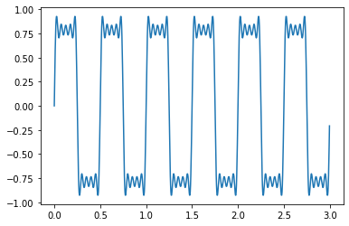
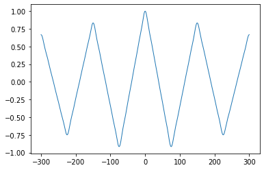
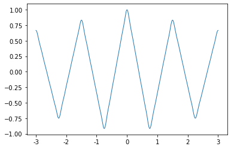
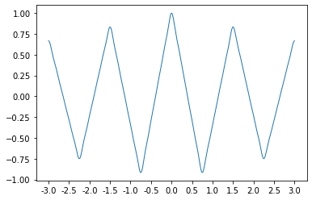
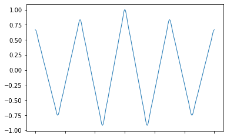

## 信号の生成と自己相関の例
例として、サンプリング周波数 300 で 3 秒の矩形波を考える。

```py
import numpy as np
import matplotlib.pyplot as plt

# サンプリング数
n: int = 900

# サンプリング周波数
fs: int = 300

print(
    f"サンプリング数: {n:d}\n"
    f"サンプリング周波数: {fs:d}\n"
    f"サンプリング時間: {n/fs:.2f} 秒"
)

# 時間の配列
t: np.ndarray = np.arange(n) / fs

# 信号の周波数 [Hz]
f: float = 2

# 信号
x = np.sum([np.sin(f * 2 * np.pi * (2 * i + 1) * t) / (2 * i + 1) for i in range(5)], axis=0)

fig, ax = plt.subplots()
ax.plot(t, x)
plt.show()
```

> 出力:
> 
> ```
> サンプリング数: 900
> サンプリング周波数: 300
> サンプリング時間: 3.00 秒
> ```
> 
> 

例えばこの信号について、
1 秒の自己相関をとると、

```py
fig, ax = plt.subplots()
ax.acorr(x, maxlags=fs, usevlines=False, linestyle="-", marker=None, lw=1)
plt.show()
```

> 出力:
> 
> 

と横軸時間が実際の時間とは異なる。

## 横軸の書き換え
上記の方法では横軸の時間がサンプリングのインデックスとなってしまい、時間に対応していない。

そのため、`matplotlib.axes.Axes.set_xticks` と `matplotlib.axes.Axes.set_xticklabels` を設定し、例えば以下のようにして横軸の数字を書き換える。

```py
fig, ax = plt.subplots()
ax.acorr(x, maxlags=fs, usevlines=False, linestyle="-", marker=None, lw=1)
ax.set_xticks(np.arange(-300, 301, 100))
ax.set_xticklabels(np.arange(-3, 4))
plt.show()
```

> 出力:
> 
> 

`set_xticks` は横軸目盛りのインデックスで、`set_xticklabels` は目盛りのインデックスに対応したラベルである。

ここで、`set_xticks` で [-300, 200, ..., 300] を設定しており、
`set_xticklabels` で [-3, -2, ..., 3] を設定している。

## 目盛りの幅を変更
上と同じように、
`set_xticks` で [-300, -250, ..., 300] を設定し、
`set_xticklabels` で [-3., -2.5, ..., 3.] を設定する。

```py
fig, ax = plt.subplots()
ax.acorr(x, maxlags=fs, usevlines=False, linestyle="-", marker=None, lw=1)
ax.set_xticks(np.arange(-300, 301, 50))
ax.set_xticklabels(np.arange(-3, 3.1, 0.5))
plt.show()
```

> 出力
> 
> 

## 横軸ラベルを非表示に設定
横軸ラベルを設定したい場合は、空配列を設定することでできる。

```py
fig, ax = plt.subplots()
ax.acorr(x, maxlags=fs, usevlines=False, linestyle="-", marker=None, lw=1)
ax.set_xticklabels([])
plt.show()
```

> 出力:
> 
> 

