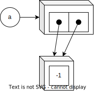
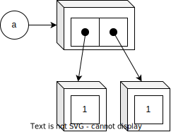

## リストの中に同じリストを複数並べる例
リストの中に同じリストを複数並べる例を考える

```py
>>> a = [[1]] * 2
>>> a
[[1], [1]]
>>> a[0][0] = -1
>>> a
[[-1], [-1]]
```

このとき、`a[0][0] = -1` とすると、`a` は
`[[-1], [1]]` になると思いきや、`[[-1], [-1]]` になってしまう。

これは、以下の図のように、`a[0]` の `[1]` と `a[1]` の `[1]` が同じ物であるからである。


よって、`a[0][0] = -1` は `a[0][1] = -1` でもあるため、



こうなってしまう。

## 対策: その 1
では、どうすればいいかというと、`a[0]` と `a[1]` が異なればよい。

```py
>>> a = [[-1] for _ in range(2)]
>>> a[0][0] = -1
>>> a
[[1], [-1]]
```

この場合、`a[0]` と `a[1]` は別の配列であるため、`a` は `[[1], [-1]]` となる。



`a[0]` の中身を書き換えたところで、`a[0]` は `a[1]` と別物であるため `a[1]` には影響しない。


## 対策: その 2
そもそも、新しい配列を定義してしまう。

```py
>>> a = [[1]] * 2
>>> a
[[1], [1]]
>>> a[0] = [-1]
>>> a
[[-1], [1]]
```

`a[0]` と `a[1]` は同じ配列である。


ここで、`a[0]` の配列に新しい配列を生成してしまえばよい。


`a[0]` と `a[1]` は異なる配列となり、`a` は `[[-1], [1]]` となる。

## 何がいけないのか
1. 破壊的メソッド (inplace メソッド)
2. 複数の変数が同じオブジェクトを指す

である

### 破壊的メソッド
破壊的メソッドはオブジェクト (この場合は配列) の中身を直接書き換えてしまうため、
同じオブジェクトを参照している変数があった場合に、書き変わった内容を参照してしまう。

```py
>>> a = [1]
>>> b = a
>>> b[0] = -1
>>> a
[-1]
```

これも、似たようなものである。`a` と `b` は同じ `[1]` を参照しているため、
`b` を書き換えると、当然 `a` も変わる。
深いコピーを用いて `b` は `a` と異なる配列を指すようにすれば問題ない。

```py
>>> a = [1]
>>> b = a.copy()
>>> b[0] = -1
>>> a
[1]
```

### 複数の変数が同じオブジェクトを指す
そもそも、同じオブジェクトを指す変数が複数あるのが悪い。
同じオブジェクトを指す変数はなくすべきである。
