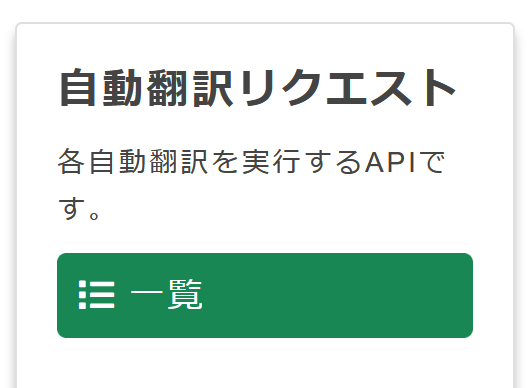
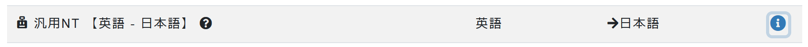
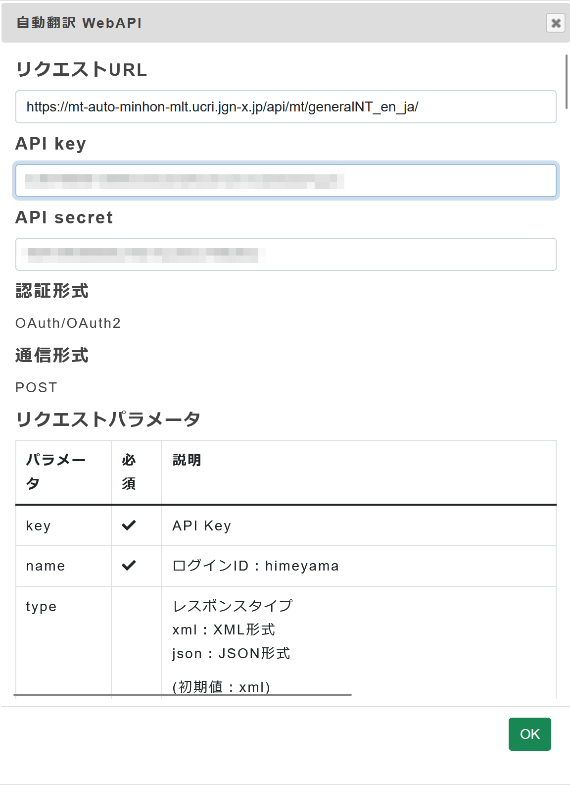
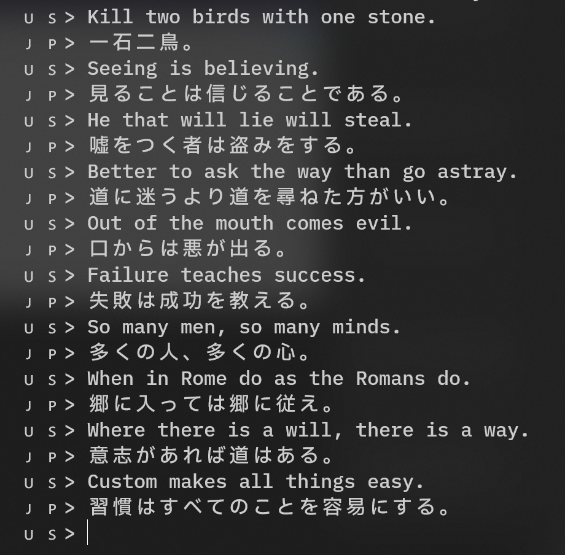

Ruby で TexTra の Web API を叩き翻訳する 2、30 行の簡単なスクリプトを作成した。


## API key の取得

TexTra に登録する必要があるので、登録しておく。

ログイン後、以下をクリックしていき、API キーを取得する。

> 

> 

以下のようにリストが表示されるので、
「汎用NT 【英語 - 日本語】」を探し、右側の ℹ️ をクリックする。

> 

API を叩くのに必要な情報が表示される。

> 

取得した情報は、漏洩しないよう注意する。

## 環境変数の設定

`.bashrc` に以下を登録する。(bash の場合は。)

Ruby スクリプトに対応するように設定する。

```bash showLineNumbers title='~/.bashrc'
export TexTra_URI_EN_JA=https://mt-auto-minhon-mlt.ucri.jgn-x.jp/api/mt/generalNT_en_ja/
export TexTra_ID=【TexTra に登録した ID】
export TexTra_API_KEY=【API key】
export TexTra_API_SECRET=【API secret】
```


## 対話翻訳スクリプトの作成
`oauth` Gem に依存しているため、インストールする。

```bash showLineNumbers
gem install oauth
```


```ruby showLineNumbers title='translate-dialog.rb'
#!/usr/bin/env ruby
# frozen_string_literal: true

require 'oauth'
require 'json'

consumer = OAuth::Consumer.new(ENV['TexTra_API_KEY'], ENV['TexTra_API_SECRET'])
@token = OAuth::AccessToken.new(consumer)

def translate(text)
  response = @token.post(
    ENV['TexTra_URI_EN_JA'], {
      key: ENV['TexTra_API_KEY'],
      type: 'json',
      name: ENV['TexTra_ID'],
      text: text
    }
  )
  JSON.parse(response.body)['resultset']['result']['text']
end

loop do
  print('🇺🇸> ')
  input = gets.chop
  break if input == ':q'

  puts("🇯🇵> #{translate(input)}")
end
```

英語を入力すると翻訳される。`:q` で終了。

> 実行結果 (ことわざを例に)
> 
> 
