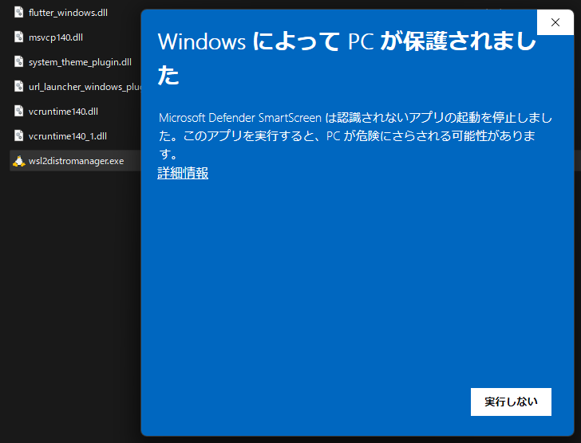
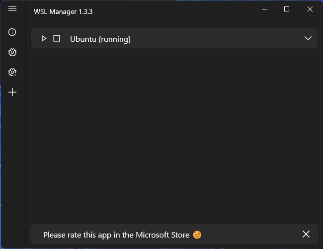
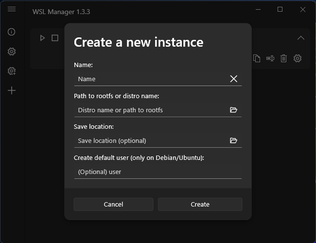
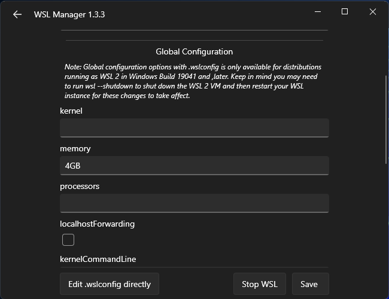

WSL2 を管理する GUI ツールである WSL Distro Manager ([wsl2-distro-manager](https://github.com/bostrot/wsl2-distro-manager)) を試す。

## 実行方法
https://github.com/bostrot/wsl2-distro-manager/releases/ から 
wsl2-distro-manager-vx.x.x.zip をダウンロード。

展開し、`%USERPROFILE%` にでもコピーしておく。

wsl2distromanager.exe をクリックし、警告が出るが、たぶん問題ないので「詳細情報」をクリックし「実行」する。

以下のウィンドウが出て、ツールが起動する。

折り畳みを開くと、アイコンが出てくる。

これらのアイコンで、

- WSL のディレクトリを開く
- WSL を VSCode で開く
- WSL のインスタンスを複製
- インスタンス名の変更
- インスタンスを消去
- 設定

が可能。

インスタンスの追加は、左アイコンメニューの「＋」から可能。

WSL の設定ファイルである `.wslconfig` に書くような設定は左アイコンメニューの上の歯車「⚙」から可能。

