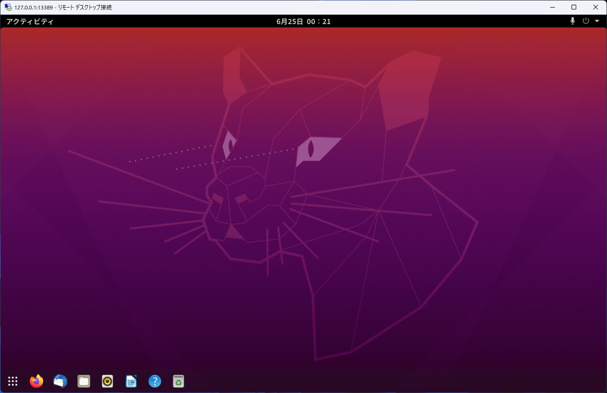
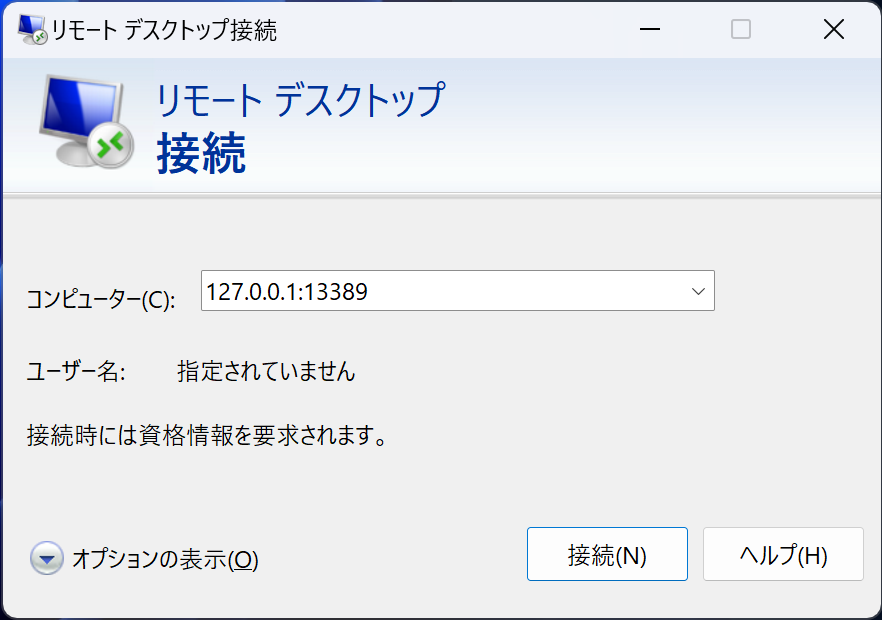

上の画像のようにリモートデスクトップ接続によって、WSL の Ubuntu デスクトップに接続する環境を作ることが目標です。

とても面倒です。

## 公開鍵の取得
Windows 側から WSL に ssh できるように公開鍵を登録します。
ssh を使用するのは、RDP のポート転送のためです。

```ps1 showLineNumbers title='Windows 側'
PS > cat .\.ssh\id_ed25519.pub
ssh-ed25519 AAAAC3NzaC1lZDI1NTE5AAAAIKYztjZfIVMl5o0J2DrigTsl1XgbSKMUgYCpfOfhMtmw hikari@B450M-K
```

:::note
Windows で公開鍵を作成していない場合は、以下のコマンドを実行してください。

```bash
PS > ssh-keygen -t ed25519
```
:::

## WSL 側の設定

### Systemd を使用するための環境を作成
WSL は Systemd が動きません。
無理くり動かすためのツール genie を用いるとうまくいきます。

詳しくは、よくわからないので、https://qiita.com/sakai00kou/items/0b401faf6dd72ad63d87 の記事を参考にしてください。

:::warning
以下のコードは雑にあまり理解しないまま書いているので、
自己責任でお願いします。
:::

```bash showLineNumbers
sudo apt install -y daemonize

wget https://packages.microsoft.com/config/ubuntu/20.04/packages-microsoft-prod.deb -O packages-microsoft-prod.deb
sudo apt install -y ./packages-microsoft-prod.deb
rm ./packages-microsoft-prod.deb
sudo apt update
sudo apt install -y apt-transport-https dotnet-sdk-5.0 aspnetcore-runtime-5.0

sudo wget -O /etc/apt/trusted.gpg.d/wsl-transdebian.gpg https://arkane-systems.github.io/wsl-transdebian/apt/wsl-transdebian.gpg
sudo chmod a+r /etc/apt/trusted.gpg.d/wsl-transdebian.gpg
sudo tee /etc/apt/sources.list.d/wsl-transdebian.list << EOF > /dev/null
deb https://arkane-systems.github.io/wsl-transdebian/apt/ $(lsb_release -cs) main
deb-src https://arkane-systems.github.io/wsl-transdebian/apt/ $(lsb_release -cs) main
EOF
sudo apt update
sudo apt install -y systemd-genie

sudo rm /etc/systemd/system/multipath-tools.service
sudo rm /etc/systemd/system/sysinit.target.wants/multipathd.service
sudo rm /etc/systemd/system/sockets.target.wants/multipathd.socket
sudo rm /etc/systemd/system/multi-user.target.wants/atd.service
sudo e2label /dev/sdc cloudimg-rootfs
sudo systemctl disable multipathd.socket

genie -s
```

### 公開鍵の登録とリモートデスクトップ環境の作成
公開鍵の登録と、リモートデスクトップ環境を作成します。

```bash showLineNumbers
$ sudo apt update
$ sudo apt install -y xrdp ubuntu-desktop

# snapd の削除
sudo apt purge -y snapd

# ssh 鍵の作成
$ ssh-keygen -f $HOME/.ssh/id_ed25519 -t ed25519 -N ""

# ssh の開始
$ sudo service ssh start

$ sudo gpasswd -a xrdp ssl-cert

# xrdp のサービス開始
$ sudo service xrdp start
$ sudo service dbus start

# 公開鍵の登録
$ echo ssh-ed25519 AAAAC3NzaC1lZDI1NTE5AAAAIKYztjZfIVMl5o0J2DrigTsl1XgbSKMUgYCpfOfhMtmw hikari@B450M-K | tee -a .ssh/authorized_keys
```

:::note
### 日本語化の設定

```bash showLineNumbers
wget -q https://www.ubuntulinux.jp/ubuntu-ja-archive-keyring.gpg -O- | sudo apt-key add -
wget -q https://www.ubuntulinux.jp/ubuntu-jp-ppa-keyring.gpg -O- | sudo apt-key add -
sudo wget https://www.ubuntulinux.jp/sources.list.d/focal.list -O /etc/apt/sources.list.d/ubuntu-ja.list
sudo apt update
sudo apt install -y language-pack-ja manpages-ja ubuntu-defaults-ja 
sudo update-locale LANG=ja_JP.UTF8
```
:::

:::note
### カスタマイズ

```bash showLineNumbers
sudo apt install -y gnome-tweaks gnome-shell-extension-ubuntu-dock \
    gnome-shell-extensions gnome-shell-extension-prefs \
    yaru-theme-icon yaru-theme-gtk yaru-theme-gnome-shell

gnome-extensions enable ubuntu-dock@ubuntu.com
gsettings set org.gnome.shell disable-user-extensions false
gsettings set org.gnome.shell.extensions.dash-to-dock transparency-mode 'DYNAMIC'
gsettings set org.gnome.shell.extensions.dash-to-dock customize-alphas true
gsettings set org.gnome.shell.extensions.dash-to-dock background-opacity 0.8
gsettings set org.gnome.shell.extensions.dash-to-dock max-alpha 0.8
gsettings set org.gnome.shell.extensions.dash-to-dock show-apps-at-top true
gsettings set org.gnome.shell.extensions.dash-to-dock custom-theme-shrink true
gsettings set org.gnome.shell.extensions.dash-to-dock dock-fixed true
gsettings set org.gnome.shell.extensions.dash-to-dock dock-position 'BOTTOM'
gsettings set org.gnome.shell.extensions.dash-to-dock dash-max-icon-size 30
gsettings set org.gnome.shell.extensions.dash-to-dock extend-height true
gnome-extensions enable user-theme@gnome-shell-extensions.gcampax.github.com
gsettings set org.gnome.shell.extensions.user-theme name Yaru-red-dark
gsettings set org.gnome.desktop.wm.preferences button-layout appmenu:minimize,maximize,close
gsettings set org.gnome.desktop.interface gtk-theme Yaru
gsettings set org.gnome.desktop.sound theme-name Yaru
gsettings set org.gnome.desktop.interface icon-theme Yaru
gsettings set org.gnome.desktop.interface cursor-theme Yaru
```
:::

公開鍵の登録後、Windows 側で ssh が可能か確認します。

```bash title="ssh で WSL にログインできるかテスト"
PS > ssh $(wsl -- hostname -I).trim() -l $(wsl -- id -un)
$ exit
```

再び、ポート転送オプションを使用して WSL に接続します。

```ps1
PS > ssh $(wsl -- hostname -I).trim() -l $(wsl -- id -un) -L13389:localhost:3389
```

リモートデスクトップ接続を開き、`127.0.0.1:13389` に接続します。



パスワード認証終了後、以下のようになります。


:::note
## 認証後画面が黒くなる場合
一度 WSL を終了します。

```bash
wsl -t Ubuntu
```
:::

## 次回以降の起動
終了するごとに毎回ポート転送する必要があります。

```ps1
PS > ssh $(wsl -- hostname -I).trim() -l $(wsl -- id -un) -L13389:localhost:3389
```

genie は自動起動しないため、毎回起動する必要があります。

```bash
genie -s # 少し待つ
```