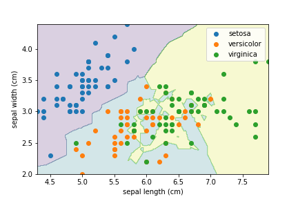

import Tabs from '@theme/Tabs';
import TabItem from '@theme/TabItem';

## 領域をプロットする関数の用意
下のコードは領域をプロットする関数 `visualize_model` です。
いろいろ参考にしながら適当に作りました。
網目状の一つ一つの点に対し予測を行い領域をプロットする仕組みです。

```py
import numpy as np
import matplotlib.pyplot as plt

def visualize_model(X, y, model, feature_names, target_names, step: float = 0.01):
    x1 = np.arange(X[:, 0].min(), X[:, 0].max(), step)
    x2 = np.arange(X[:, 1].min(), X[:, 1].max(), step)

    xx1, xx2 = np.meshgrid(x1, x2)
    x1x2 = np.array([xx1.ravel(), xx2.ravel()]).T

    fig, ax = plt.subplots()
    ax.contourf(
        xx1,
        xx2,
        model.predict(x1x2).reshape((x2.size, x1.size)),
        alpha=0.2
    )

    ax.set_xlabel(feature_names[0])
    ax.set_ylabel(feature_names[1])
    for _y in np.unique(y):
        ax.scatter(*X[y == _y].T, label=target_names[_y])
    ax.legend()
    plt.show()
```

## iris データの読み込み
iris データを用意し、今回は `sepal width` と `sepal length` による学習と予測を行います。
(特徴量は 4 つのうち 2 つだけ使用します。)

今回、評価しないので全て訓練データです。

```py
from sklearn.datasets import load_iris

iris = load_iris()
X, y = iris.data[:, [0, 1]], iris.target
feature_names = iris.feature_names[0:2]
```

## 様々なモデルを試す

### kNN (k 最近傍法)

```mdx-code-block
<Tabs>
<TabItem value="コード">
```

```py
from sklearn.neighbors import KNeighborsClassifier

model = KNeighborsClassifier(n_neighbors=3)
model.fit(X, y)
visualize_model(X, y, model, feature_names, iris.target_names)
```

```mdx-code-block
</TabItem>
<TabItem value="結果">
```



```mdx-code-block
</TabItem>
</Tabs>
```


### 決定木
```mdx-code-block
<Tabs>
<TabItem value="コード">
```

```py
from sklearn.tree import DecisionTreeClassifier

model = DecisionTreeClassifier()
model.fit(X, y)
visualize_model(X, y, model, feature_names, iris.target_names)
```

```mdx-code-block
</TabItem>
<TabItem value="結果">
```


```mdx-code-block
</TabItem>
</Tabs>
```


### ランダムフォレスト
```mdx-code-block
<Tabs>
<TabItem value="コード">
```

```py
from sklearn.ensemble import RandomForestClassifier

model = RandomForestClassifier()
model.fit(X, y)
visualize_model(X, y, model, feature_names, iris.target_names)
```

```mdx-code-block
</TabItem>
<TabItem value="結果">
```


```mdx-code-block
</TabItem>
</Tabs>
```


### SVM (サポートベクターマシーン)
```mdx-code-block
<Tabs>
<TabItem value="コード">
```

```py
from sklearn.svm import SVC

model = SVC()
model.fit(X, y)
visualize_model(X, y, model, feature_names, iris.target_names)
```

```mdx-code-block
</TabItem>
<TabItem value="結果">
```


```mdx-code-block
</TabItem>
</Tabs>
```

### ロジスティック回帰
```mdx-code-block
<Tabs>
<TabItem value="コード">
```

```py
from sklearn.linear_model import LogisticRegression

model = LogisticRegression()
model.fit(X, y)
visualize_model(X, y, model, feature_names, iris.target_names)
```

```mdx-code-block
</TabItem>
<TabItem value="結果">
```


```mdx-code-block
</TabItem>
</Tabs>
```

### ニューラルネットワーク
```mdx-code-block
<Tabs>
<TabItem value="コード">
```

```py
from sklearn.neural_network import MLPClassifier

model = MLPClassifier()
model.fit(X, y)
visualize_model(X, y, model, feature_names, iris.target_names)
```

```mdx-code-block
</TabItem>
<TabItem value="結果">
```


```mdx-code-block
</TabItem>
</Tabs>
```


### LightGBM
```mdx-code-block
<Tabs>
<TabItem value="コード">
```

```py
from lightgbm import LGBMClassifier

model = LGBMClassifier()
model.fit(X, y)
visualize_model(X, y, model, feature_names, iris.target_names)
```

```mdx-code-block
</TabItem>
<TabItem value="結果">
```


```mdx-code-block
</TabItem>
</Tabs>
```
