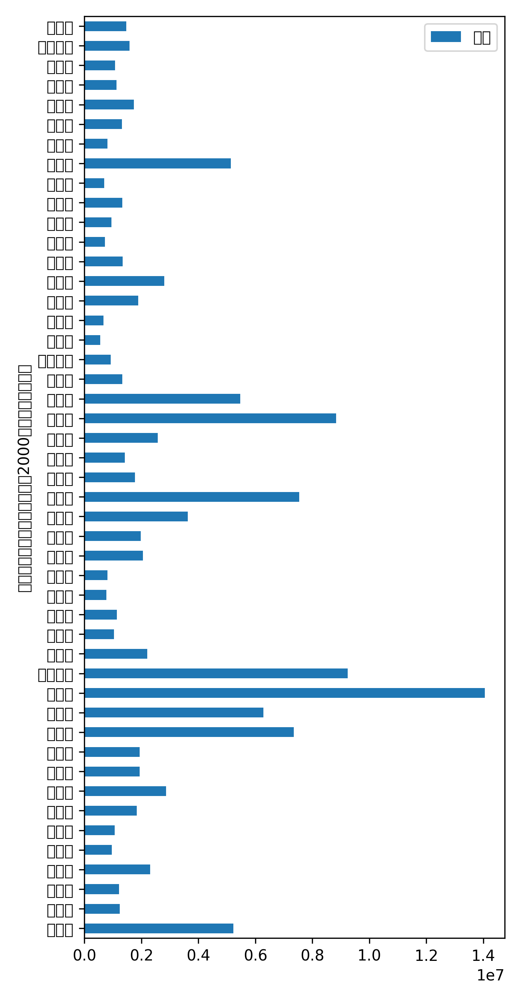
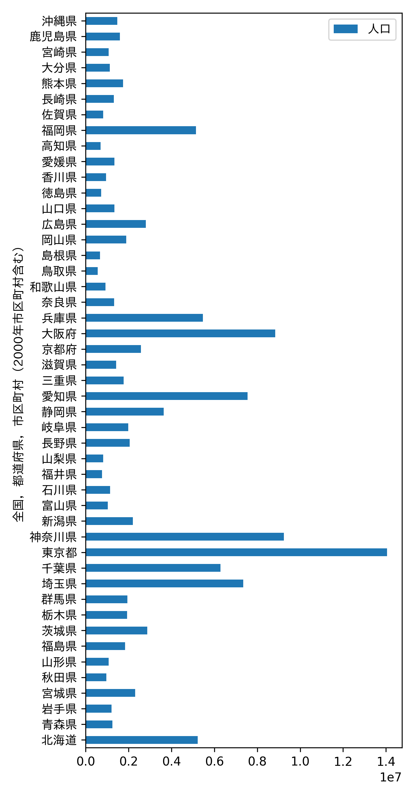

Matplotlib の日本語の豆腐文字化けの対処法を
日本の都道府県別人口のグラフを例に紹介します。

## データを用意する
まず、データを用意します。

https://www.e-stat.go.jp/dbview?sid=0003445078

国勢調査のサイトから、
「国勢調査 令和２年国勢調査 人口等基本集計　（主な内容：男女・年齢・配偶関係，世帯の構成，住居の状態，母子・父子世帯，国籍など）」の CSV ファイルをダウンロード。

```python
import matplotlib.pyplot as plt
from sklearn.datasets import load_wine
import pandas as pd

df = pd.read_csv("FEH_00200521_221124023823.csv", encoding="shift_jis")
df = df[(df["area_code"].str.contains("\d\d000")) & (df["男女"] == "総数")].iloc[1:, :]
df = df.reset_index().drop("index", axis=1)
df["value"] = df["value"].astype(int)
```

## グラフをプロットする
文字化けします。

```python
fig, ax = plt.subplots(figsize=(4.8, 9.2))
df.plot(kind="barh", x="全国，都道府県，市区町村（2000年市区町村含む）", y="value", label="人口", ax=ax)
plt.show()
```



## 対処法
テキストオブジェクト https://matplotlib.org/stable/api/text_api.html 
に対して日本語フォントを設定する。

`.set_fontfamily("IPAexGothic")` で設定。

```python
fig, ax = plt.subplots(figsize=(4.8, 9.2))
df.plot(kind="barh", x="全国，都道府県，市区町村（2000年市区町村含む）", y="value", label="人口", ax=ax)
for text in ax.get_yticklabels():
    text.set_fontfamily("IPAexGothic")
ax.get_legend().get_texts()[0].set_fontfamily("IPAexGothic")
ax.set_ylabel(ax.get_ylabel()).set_fontfamily("IPAexGothic")
```



IPAexGothic の良くないところは太字が使えないところ。
デフォルトの 'sans-serif' は太字表示可能なので、
太字を使用したいのならば、日本語にせずそのままがいいかも。