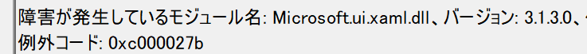

## 概要
Visual Studio 2022 で WinUI アプリをビルドし、実行ファイルを実行して強制終了する。
(ただし、Visual Studio から直接実行した場合は正常に動作する。)
また、`dotnet run` コマンドでアプリを実行した場合も同様に強制終了する。

イベント ビューアーで調べたところ、Microsoft.ui.xaml.dll が原因とのことだった。



## 調査
コードを削除したりして、実行していくと、

```csharp
ApplicationData.Current.LocalSettings;
```

を削除すると正常に起動することが判明した。
そのため、一時的に以下のように変更し、正常起動した。

```csharp
try
{
    config = ApplicationData.Current.LocalSettings;
}
catch (Exception ex)
{
    ...    
}
```

謎は深まるばかり。